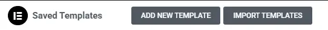
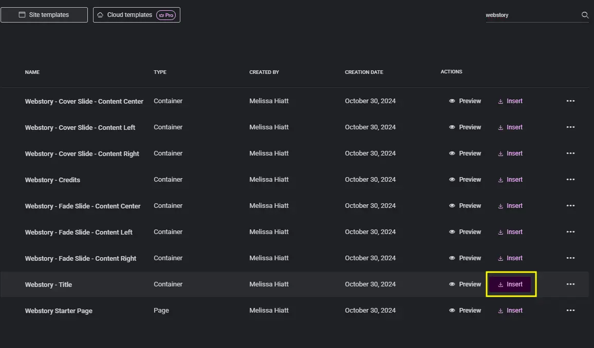
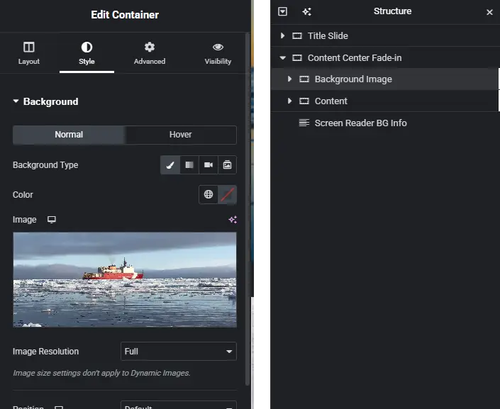

# Webstory Templates for Elementor

Webstory Templates for Elementor allow websites to self-host visual stories through the use of the Elementor plugin. This replaces the need to use third-party vendors to create and host storymaps or visual stories. Self-hosting this format will allow you to track analytics through your installed aggregator.

These templates have been exported in JSON format and are responsive, tested for accessibility, and mobile-ready. You will need to customize to your site's style and branding.

## Requirements
- Latest installation of WordPress
- Elementor Plugin
- Dynamic.ooo - Dynamic Content for Elementor Plugin*
- Advanced Custom Fields Plugin** 

*This allows the title of the post to be used as the title for the slide. If it is not available, you can manually type in the title.\
**Advanced Custom Fields or the ability to add a [Custom Post Type](https://wordpress.org/documentation/article/what-is-post-type/#custom-post-types) is recommended so you can apply a [single template](https://wordpress.org/documentation/article/what-is-post-type/#custom-post-types) to all webstory posts. Alternatively, you can create a separate template that can be applied per post/page. The template should allow content to expand full-screen.

**This has not been tested on Drupal sites with Elementor installed.**

## Installation
1. In the WordPress admin, navigate to "Templates"
2. At the top bar, click "Import Templates"\

3. Upload the templates.zip for all files or you may import each JSON file individually.
4. The templates will be added to your "Saved Templates"

## Basic Usage
Each template serves as a separate screen / panel of your webstory.

### Inserting a template
1. In the Elementor editor, click the folder icon to open the templates modal.\

2. At the top of the modal, navigate to "Templates" and search for "webstory" to easily access the imported templates.
3. Select the template you would like to use and click "Insert" on the right.\

Click "Apply" to apply settings to the container.

### Editing the template
Make sure that your structure sidebar is open to access all the layers. This is found in the top bar.\ .

**Templates has a basic container structure:**

**Background**
This is the background image of the panel. To edit, navigate to the style tab on the left sidebar and replace the background. You can set the background overlay to your desired color and opacity.\

**Content**
This container is animated and holds a text placeholder for your content. Animations can be adjusted in the *Advanced* text panel under *Motion Effects > Scrolling Effects*.

**Screen Reader BG Info**
Because the panel's background is set as a background image, the Alt text cannot be read by screen readers. As a workaround, this transparent text box was created and intended for use only by screen readers to meet accessibility standards. You may adjust the positioning of this text box to "absolute" so not to disturb your layout. You can find this setting under *Advanced > Layout > Position*

### Template files
| Template Name | Description |
| ----------- | ---------- |
| Webstory - Title | The title panel. If Dynamic.ooo is installed, the title is taken from the title of the post. Otherwise, you may enter the title manually |
| Webstory - Credits | Usually placed at the end of the page, it is a placeholder for credits or additional information. Currently has OAP branding, so you will want to edit the master template|
| Webstory - Reveal Slide - {content position} | Content slide with a fixed background. The panel is "revealed" as you scroll down the page |
| Webstory - Fade Slide - {content position} | Content slide with a background that fades in as you scroll down the page |

